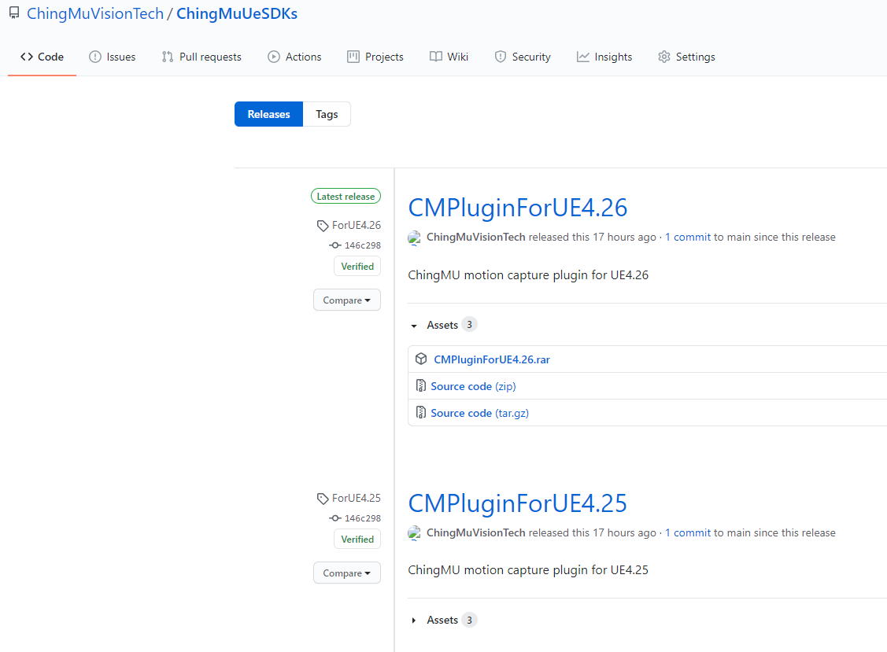
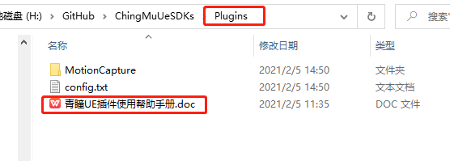
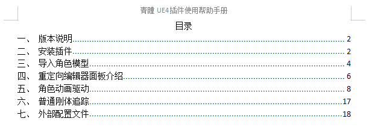

## ChingMU UE4 插件说明

**插件下载：**       
<!---
[CMPlugin For UE4.26](https://github.com/ChingMuVisionTech/ChingMuUeSDKs/releases/download/ForUE4.26/CMPlugin_UE4.26.rar)  
[CMPlugin For UE4.27](https://github.com/ChingMuVisionTech/ChingMuUeSDKs/releases/download/UE4.27/CMPlugin_UE4.27.rar)   
[CMPlugin For UE5.00](https://github.com/ChingMuVisionTech/ChingMuUeSDKs/releases/download/UE5.0/CMPlugin_UE5.0.rar)   
-->

[CMPlugin For UE4.26](https://github.com/ChingMuVisionTech/ChingMuUeSDKs/releases/download/new_CMPlugin_UE4.26/CMPlugin_UE4.26.rar)  
[CMPlugin For UE4.27](https://github.com/ChingMuVisionTech/ChingMuUeSDKs/releases/download/CMPlugin_UE4.27/CMPlugin_UE4.27.rar)   
[CMPlugin For UE5.00](https://github.com/ChingMuVisionTech/ChingMuUeSDKs/releases/download/CMPlugin_UE5.0/CMPlugin_UE5.0.rar) 

[插件帮助文档](https://github.com/ChingMuVisionTech/ChingMuUeSDKs/releases/download/UE_DOC/UE.doc)

[插件视频教学](https://github.com/ChingMuVisionTech/ChingMuUeSDKs/releases/download/help/Help.mp4)
### 1 引言

（1）ChingMU UE4插件提供了青瞳动捕在UE4中使用时的各种功能API接口。 
（2）ChingMU UE4插件支持多个UE4版本，目前有ChingMU plugin for UE4.26,UE4.27,UE5.0三个版本在迭代更新。

### 2 用途与功能

你可以使用ChingMU UE4插件在UE4中利用青瞳动捕来实现各种相关应用，如虚拟影视拍摄实时预览，虚拟角色直播，VR头显定位，或者其他物体的定位。

### 3 如何开始 

（1）在Git上下载相应版本的CMPluginForUE4，如下图所示 
 

（2）解压后，在Plugins文件下找到 青瞳UE4插件使用帮助手册 如下图所示 
 

（3）打开 青瞳UE4插件使用帮助手册 跟随文档中的目录章节学习如何使用插件提供的相关功能。 

